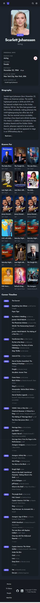

# Movie Browser

TMDB-powered movie and TV discovery app built with React, TypeScript, Vite, React Router, and TanStack React Query.

This project is structured like a production frontend rather than a demo. It uses typed service layers, route-driven screens, shared UI components, and React Query for API caching and request lifecycle management.

[](https://choosealicense.com/licenses/mit/)

## Overview

Movie Browser lets you browse trending titles, drill into movie and TV details, explore people, search across multiple TMDB entity types, and save titles to a persistent local watchlist.

The current UI is built with Tailwind CSS v4 and daisyUI v5, with a page-driven layout and reusable media components for galleries, trailers, cards, and loading states.

## Features

- Browse trending content from the home page with a featured hero section.
- Explore movie and TV categories including popular, top rated, upcoming, now playing, airing today, and on the air.
- Filter movie and TV lists by genre.
- Search across movies, TV shows, people, collections, keywords, and companies.
- View rich movie and TV detail pages with cast, crew, trailers, videos, and image galleries.
- Explore people pages with biography, external social links, known-for credits, and a career timeline.
- Save movies and TV shows to a localStorage-backed watchlist.
- Use debounced search and URL-driven pagination for shareable navigation state.
- Benefit from React Query caching and request deduplication across the app.
- Run a tested frontend with Vitest, Testing Library, and coverage thresholds set at 70%.

## Routes

- `/` - Home and trending discovery
- `/movies` - Movie catalog
- `/movies/:movieId` - Movie details
- `/tv-shows` - TV catalog
- `/tv-shows/:tvShowId` - TV details
- `/people` - Popular people
- `/people/:personId` - Person details
- `/search` - Multi-category search results
- `/watchlist` - Saved titles

## Tech Stack

- React 18
- TypeScript
- Vite
- React Router
- TanStack React Query
- Axios
- Tailwind CSS v4
- daisyUI v5
- Vitest
- Testing Library

## Screenshots




## Project Structure

```text
src/
  api/          TMDB service functions and React Query hooks
  components/   Reusable UI building blocks
  layout/       Shared app shell
  pages/        Route-level screens
  routes/       Router definitions
  hooks/        Reusable client hooks such as watchlist persistence
  types/        Shared API and UI types
  styles/       Global Tailwind and app-level styles
```

## Architecture Notes

- All TMDB requests go through the shared Axios instance in `src/config/axios.ts`.
- Data fetching is handled through TanStack React Query hooks under `src/api/*/query`.
- Route definitions are centralized in `src/routes/router.tsx`.
- Search state and pagination are URL-driven using search params.
- Watchlist state is persisted locally with `localStorage` via `src/hooks/useWatchlist.ts`.

## Environment Variables

Create a `.env` file based on `.env.sample` and provide the following values:

```bash
VITE_TMDB_API_KEY=<YOUR_TMDB_API>
VITE_TMDB_API_URL=https://api.themoviedb.org/3
VITE_TMDB_IMAGE_URL=https://image.tmdb.org/t/p/w500
VITE_TMDB_IMAGE_MULTI_FACE=https://media.themoviedb.org/t/p/w1920_and_h800_multi_faces
```

## Getting Started

Clone the repository:

```bash
git clone https://github.com/frank-mendez/movie-browser
cd movie-browser
```

Install dependencies:

```bash
npm install
```

Start the development server:

```bash
npm run dev
```

Build for production:

```bash
npm run build
```

Preview the production build:

```bash
npm run preview
```

## Scripts

```bash
npm run dev        # Start Vite dev server
npm run build      # Type-check and create production build
npm run preview    # Preview the production build locally
npm run lint       # Run ESLint
npm run test       # Start Vitest in watch mode
npm run coverage   # Run tests once with coverage
```

## Testing

This project uses Vitest with Testing Library and jsdom.

```bash
npm run test
npm run coverage
```

Coverage thresholds are configured at 70% for lines, branches, functions, and statements.

## Roadmap

Planned enhancements are tracked in [roadmap.md](roadmap.md).

## License

[MIT](https://choosealicense.com/licenses/mit/)
